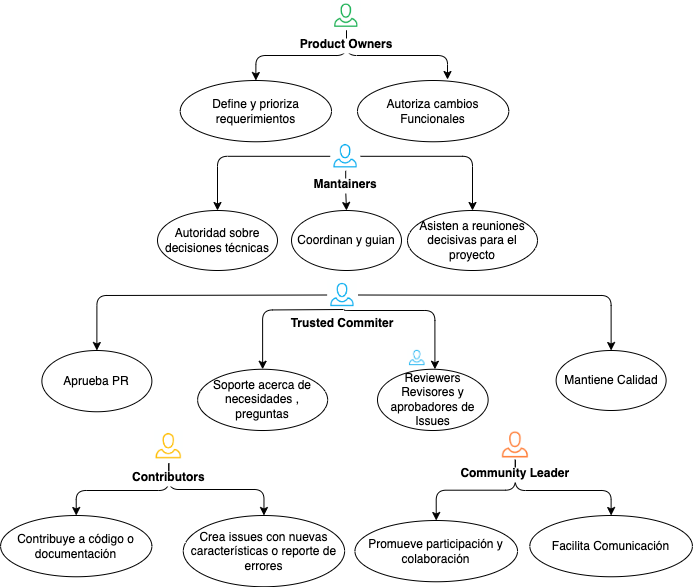

# Modelo de Gobierno

## Roles y Miembros de la comunidad

| Roles             | Responsabilidades                                            | 
| ---------------- | ------------------------------------------------------------ | 
| Product Owners | liderar la iniciativa open y sus proyectos, tener una visión a corto, mediano y largo plazo de la iniciativa y los proyectos. Tener criterio a la hora de tomar decisiones. abdicar cuando sea por el bien de la comunidad y del proyecto. 
| Mantainers           |  Los mantenedores tienen una mayor autoridad y responsabilidad en la gestión y coordinación general del proyecto.
| Trusted Commiter         |  los "trusted committers" son colaboradores que tienen la capacidad de enviar cambios directamente al repositorio del proyecto y revisar las contribuciones de otros, pero su autoridad es limitada en comparación con los mantenedores |
Contributors | Contribuir activamente con *commits*, *reviews* | 
Community Leader  | Promueve *participacion*, *colaboracion* , brinda herramientas necesarias que faciliten comunicación con la comunidad |

